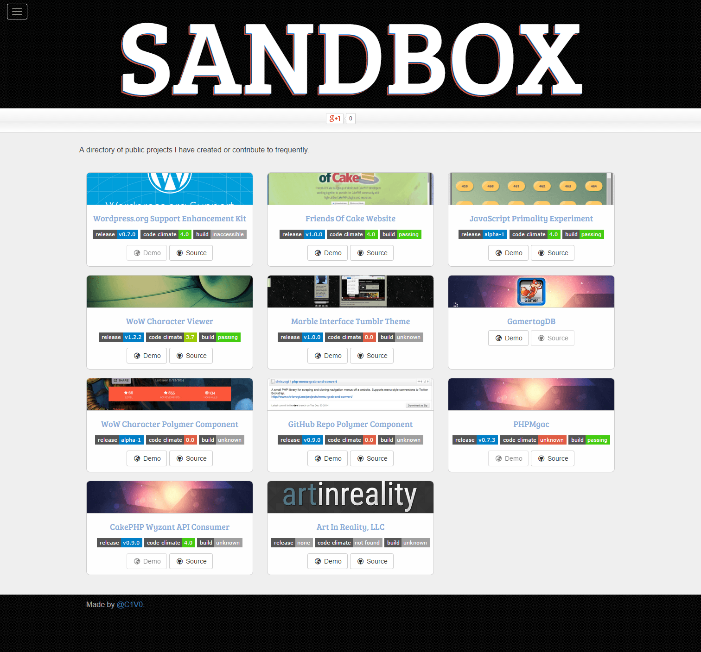

# Project Sandbox

A Phoenix web developer's directory of open source projects created or significantly contributed to.
### Screenshot

### Build Your Own

_Requires `bower` and `jekyll`._

Do your work in feature branches and merge those into `develop`. Use either `master` or `gh-pages` as needed to [publish on GitHub](https://pages.github.com/).

Use bower when in the `develop` branch to download and manage components. To publish, check out a new branch by the name you need (typically `master` or `gh-pages`), update _.gitignore_ to allow the `components/` directory to be committed, and then commit and push everything, components included, to that branch.

### License

MIT
