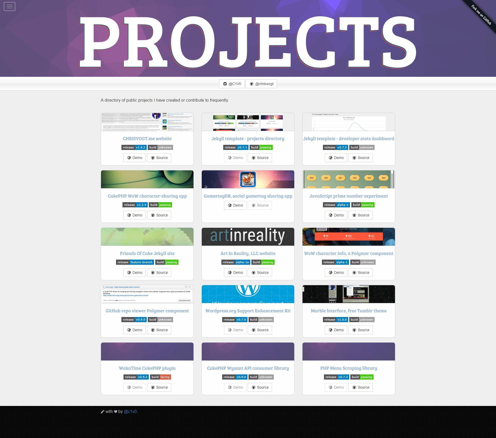

# Project Directory

A web developer's personal directory of open source projects.

### Developer Notes

_Requires `ruby`, `bower` and `jekyll` to build._

Do your work in feature branches and merge those into `develop`. Use either `master` or `gh-pages` as needed to [publish on GitHub](https://pages.github.com/).

### Screenshot

### License

MIT

___

  
